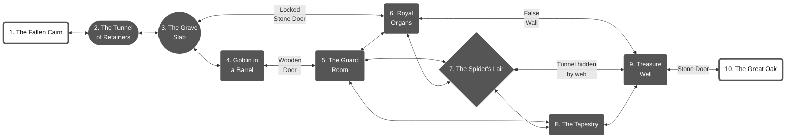

# Barrow of the Elf King
*Deep in the Old Forest, where the trees grow tall and thick, where the sun rarely pierces the canopy, is an earthen mound. No birds sing in this part of the forest, no wind blows. The leaves of the trees seem larger, the canopy thicker. Even at mid-day, it is almost too dark to see.*


## 1. The Fallen Cairn
Next to the mound lie three smooth stones, identical in shape but varying in size. The largest is too heavy to be moved by less than three people, the next requires two, and the smallest stone can be lifted by a single person. If the stones are stacked atop each other, an entryway opens on the North side of the mound mound.

## 2. The Tunnel of Retainers
A narrow stone brick tunnel is lined with small alcoves, two on each side. Each contains a skull, covered in ornamental markings in blue ink, with green gemstones (25 gp each) embedded in the eye sockets. Three of the skulls have the large eye sockets and sharp features of ancient Elfs. The other is larger, but with smaller eyes and a tusked snout of an Orq. One of the tusks is gold (20 gp). A learned explorer might discern these are the remains of retainers of high status, to have such a noble burial. A hidden silver wire is attached to the inside of each skull, the wires go into holes under the skulls. If a skull is lifted without severing the attached wire the tunnel collapses. PCs must make a DEX save or take 3d6 damage.
<br>**Entrances:** *North end of the tunnel opens to the cairn in the forest. South end of the tunnel opens into Room 3.*

## 3. The Grave Slab
An Elf king's skeleton lies on a stone slab. It's attired in white wooden armor (medium) and a crown of twisted white branches from which green leaves grow. It's crossed arms hold two black iron arrows. A large hourglass is suspended from heavy chains on a pulley system. An iron crank rotates it. When the sand starts falling the ghost of the Elf King rises from the skeleton, armed with a White Wood Great Sword. He is not happy about intruders in his tomb, where he awaits resurrection when the universe is reborn. He doesn't know about the spider, worms or any other intruders. The hourglass takes only ten minutes to run out. The ghost disappears when the sand stops falling or if the hourglass is broken. If the ghost is defeated in combat he'll vanish, leaving his sword behind.
<br>**Entrances:** *Opening in North wall leads into Room 2. Locked door in East wall goes to Room 6. Tunnel in South wall goes to Room 4.* 

## 4. Goblin in a Barrel
Stifled sobbing and the intermittent sneezing can be heard coming from a rotten barrel. Wogwurt, a small goblin, hides inside, wearing a wooden bowl as a helmet, a fake mustache made of leaves, and holding a toy sword made from two sticks tied together. She got lost in the forest and wandered into the mound through the Great Oak *(Room 10)* and can't remember the way out. She is terrified and the mildy allergic to the tomb's dust. Her family are toad shepherds in a nearby bog and will reward her rescuers with a toad steed.
<br>**Entrances:** *Tunnel in North wall goes to Room 3. Wooden door in East wall goes to Room 5.*

## 5. The Guard Room
Three skeletons dressed in rusty armor sets of varying completeness. roll dice at a small table. They are betting pieces of armor and occasionally there own bones when they've lost all their armor. An ancient enchantment bound them here to protect the tomb but the magic has eroded with time and they are terribly bored. They'll half heartedly ask intruders to leave and every conversation with, "Ok, time for you to go." or "It's getting late" with gestures towards to entrance. If destroyed they'll reassamble in one week. There is a fourth skeleton guard stuck in the spider's web in Room 7. They are scared of the spider. If their companion is rescued or their boredom is cured they will reveal that a lock box is at the bottom of the well in Room 9 but the water is a magic acid that will dissolve any items it touches but not hurt flesh or bone.
<br>**Entrances:** *Tunnel in Northwest corner goes to Room 6. Tunnel in Northeast corner splits to Rooms 6 & 7. Tunnel in Southeast corner goes to Room 8.*

## 6. Royal Organ Storage
1d6+1 barrow worms have dug through the floor and are feeding on mummified organs. Broken urns and dried organs litter the floor. There are still two urn left intact, one contains the Elf King's heart and one contains his brain, suspended in a magic jelly that keeps it from decaying.
<br>**Entrances:** *Locked door in West wall goes to Room 3. Falls wall in Northeast open into Room 9. Tunnel in East wall splits to Rooms 5 & 7. Tunnel in South wall goes to Room 5.*

## 7. The Spider's Lair
Spider webs cover the walls. Sticky web snares must be carefully avoided or a Strength Save will be needed to break free. Sargmotra Sinspinner, the oldest spider in the forest, has made this chamber their lair. Four web sacs hang from the ceiling. Two contain dessicated deers, one contains a dead woodsman with an axe and 4d4 gp, and one contains a trapped skeleton guard. Sargmotra desires to eat all living things but prefers to play with them first. They will offer to spare those who will serve them. Servants of Sargmotra are bitten and given The Spider's Blessing. This lets them climb walls and ceilings at half their normal speed and see in the dark. In exchange they must bring Sargmotra a living thing to eat every month. The Blessing must be renewed every month or the servant becomes ill and dies unless they make a succesful saving throw three days in a row.<br>
**Entrances:** *Tunnel in West wall splits to Rooms 5 & 6, tunnel in South East corner goes to Room 8, tunnel hidden by web in Northeast corner goes to Room 9.*

## 8. The Tapestry
A vibrant tapestry spans the South wall. The images move as if they are alive. It depicts the fabled Elflands: elfs dancing in a circle, birds flying, trees swaying in the wind, an armoured warrior battling a blood red dragon. The tapestry is worth 500 gp to most art dealers but could be worth many times that to a special collector. Two people could carry it if were rolled up.
<br>**Entrances:** *Tunnel in West wall goes to Room 5. Tunnel in North wall goes to Room 7. Tunnel in Northeast corner goes to Room 9.*

## 9. Treasure Well
A well in the middle of the room is filled with a magical acid. It does not harm flesh and bone but will dissolve any non living items. There is a lockbox containing 1000 gp worth of gems at the bottom that is immune to the acid. 1d6 spiders are building a web across the tunnel in the East Wall. Fresh air flows gently from this tunnel. 
<br>**Entrances:** False Wall opens to Room 6. Web covered tunnel goes to Room 7. Tunnel in East wall goes to Room 10. Tunnel in Southeast corner goes to Room 8.*

## 10. The Great Oak.
The tunnel from Room 9 ends inside this large oak tree. A hole in the oak opens into the forest. The whole is just big enough for a person to squeeze through. Packs and large items will have to be passed through seperately.
<br>**Entrances:** Tunnel goes West to Room 9. Hole in East side opens into the forest.*
<hr>

### Treasures
1. **Black Arrow:** +2d6 damage to dragons, worth 25 gp each.
2. **White Branch Crown:** The wearer can communicate telepathically with woodland creatures. Worth 250 gp.
3. **White Wood Great Sword:** +1 to damage, never dulls. If planted, in a year's time it will grow into a giant White Oak with a door to Fairyland. Worth 150 gp.
5. **Tapestry:** Magical animated images show the mythic Fairylands. Perhaps a skilled magician can find clues to the mythic country's whereabouts hidden in the tapestry.
6. **Skeleton's Worn Dice:** Whisper a number the dice and that's what they'll land on. 

### Bestiary
1. Skeleton Guard: 2HD
2. Goblin: 1HD
3. Barrow Worms: 1HD
4. Sargmotra Sinspinner: 4HD
5. Spiders: 1HD
<hr>

## Ascii Map
```               
                   .=Stone Floor   D=Door
          1        ,=Dirt          S=Secret Door
                   #=Wall          L=Locked Door
         #.#       ~=Water         *=Web
         #.#      
         #2#                #########################
         #.#                #...............~~~~~...#####
     #####.#####  ###########S#############.~~9~~~..D....
     #.........#  #....,......#    #.*....S..~~~~...#####
     #.........####..6...####.#    #.*..*.#########.#
     #....3....L....,....#  #.#    #..7...#       #.#
     #.........####....,.#  #.######...*..#       #.#
     #.........#  #.,....#  #.......*...*.#####   #.#
     #####.#####  ####.###  #.######...*......#   #.#
         #.#         #.#    #.#    #*.*...###.#   #.#
     #####.###      ##.######.#    ######## #.#   #.#
     #.......#      #.........#             #.#   #.#
     #...4...########..5......#         #####.#####.##
     #.......D................###########......8.....#
     #.......########................................#
     #########      ##################################
        
```
## Flowchart Map
